**Moved to MiSTer-Devel**

# Fuuki core for MiSTer

MiSTer FPGA core for [Fuuki](https://en.wikipedia.org/wiki/Fuuki)'s FG-2 and FG-3 arcade
platforms, built with Quartus Prime 17.0.2 Lite for the DE10-nano.

## Contents

- [Games](#games)
- [History](#history)
- [Screenshots](#screenshots)
- [Installation](#installation)
- [Status](#status)
  - [Todo](#todo)
  - [Resource usage](#resource-usage)
- [AI Attestation](#ai-attestation)
- [Verification](#verification)
- [Acknowledgements](#acknowledgements)
- [Layout](#layout)
- [License](#license)

## Games

Supports the following games

| Name | Year | Board | Main CPU | Sound CPU | Sound chips | Notes |
|-|-|-|-|-|-|-|
| Susume! Mile Smile / Go Go! Mile Smile | 1995 | FG-2 | M68000 @ 16 MHz | Z80 @ 6 MHz | YM2203 + YM3812 + OKI M6295 | |
| Gyakuten!! Puzzle Bancho | 1996 | FG-2 | M68000 @ 16 MHz | Z80 @ 6 MHz | YM2203 + YM3812 + OKI M6295 | Japan only |
| Asura Blade - Sword of Dynasty | 1998 | FG-3 | M68EC020 @ 20 MHz | Z80 @ 6 MHz | YMF278B (OPL4) | Japan. Uses the OPL4's PCM+FM synthesis |
| Asura Buster - Eternal Warriors | 2000 | FG-3 | M68EC020 @ 20 MHz | Z80 @ 6 MHz | YMF278B (OPL4) | JP 2000, US 2001. PCM only |

Both boards share the same video hardware — the FI-002K sprite chip and FI-003K tilemap chip, with a 
Mitsubishi's M60067-0901FP. Reproducing those two custom video chips is the substance of
the project. FG-3 keeps FG-2's video architecture but substitutes a 32-bit CPU, an OPL4 for sound,
sprite tile banking, deeper tiles and a second work RAM.

Some links discussing the games and hardware:
* https://www.hardcoregaming101.net/series/asura-buster-blade/
* https://nicole.express/2025/a-very-fuuki-circuit-board.html

## History

* Arcade-Fuuki_20260916.rbf
  * **gogomile's music stopping mid-game.** The main CPU ran faster than the original between sound commands
  * **FG-2 sample playback no longer stalls** after minutes of play (OKI ROM fetch deadlock).
  * **Asura Blade's coin jingle** is no longer scratchy or quiet (three OPL4 PCM fixes, checked against ymfm).
  * OSD: Audio mix (mono by default), CRT H-Size and V-Size.
  * The .mra files name the core `Fuuki`, and every part carries its CRC32.

* Arcade-Fuuki_20260909.rbf
  * **Beta release**
  * **pbancho's flickering black bands fixed** (sprite engine prefetch).
  * **gogomile's title-cloud stray line fixed** (raster interrupt one line early, measured).

* Arcade-Fuuki_20260907.rbf
  * **Beta release**
  * **FG-3 sound effects fixed.**

* Arcade-Fuuki_20260906.rbf
  * **Alpha release**
  * **Sound.** FG-2's Z80 with the YM2203 / YM3812 / OKI M6295 set, and FG-3's Z80 with the YMF278B — Psikyo's OPL4 PCM engine plus gtaylormb/opl3_fpga for the FM half. Asura games are buggy and sounds are silent or cut out.
  * HDMI rotation and Flip 180, vertical crop, integer scaling, CRT offset.
  * gogomile's title-cloud jitter is fixed: the raster register is 8 bits, not 9.

* Arcade-Fuuki_20260905.rbf
  * **Alpha release**
  * Games all run fine
  * No sound
  * Raster effects are rough in places
  * Includes fast DDR loading
  * No HDMI rotate/flip yet

## Screenshots

### Susume! Mile Smile / Go Go! Mile Smile

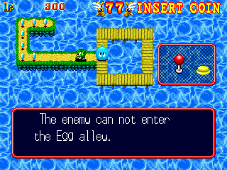
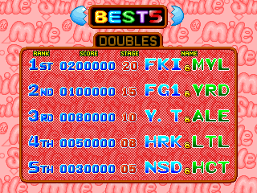

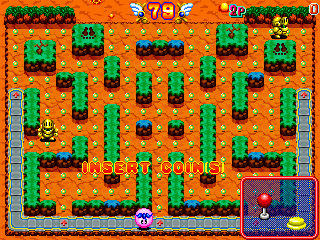
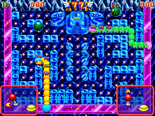
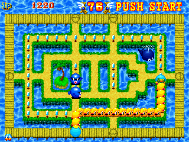

### Gyakuten!! Puzzle Bancho

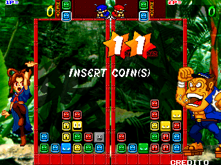
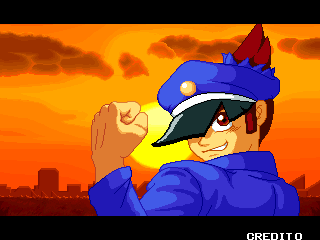
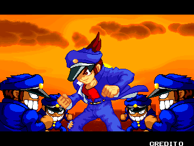
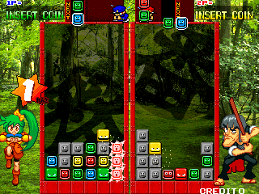
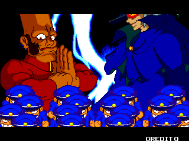
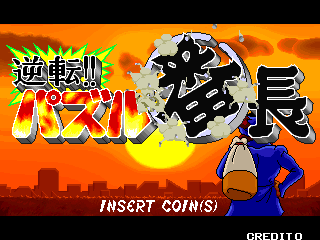
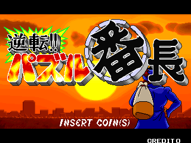

### Asura Blade - Sword of Dynasty

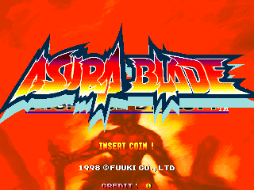

### Asura Buster - Eternal Warriors

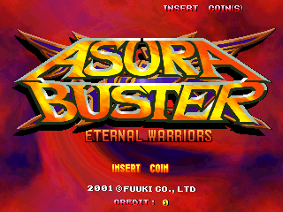
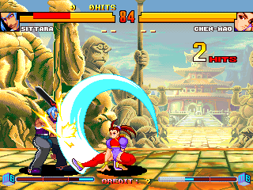

## Installation

* Take the latest `*.rbf` from `releases/` and put it in `_Arcade/cores`
* Take the `*.mra` files from `releases/` and put them in `_Arcade/_Fuuki`
* Put the MAME merged or split ROMs in `games/mame`

FG-3 (Asura Blade / Asura Buster) needs **64MB or more SDRAM module**

## Status

Known issues:
* Unsure about the raster effects at the end of a match on Asura Buster/Blade. Same as MAME, but would love to see real hardware

### Todo

- [x] HDMI rotation and Flip 180, vertical crop, integer scaling, CRT Adjust (H-Position, V-Shift, H-Size, V-Size)
- [ ] Hiscore support
- [ ] The DIP Flip Screen in the renderer

### Resource usage

Whole core, on the DE10-nano's Cyclone V 5CSEBA6, speed grade 7, for the bitstream in `releases/`:

| resource | used | available |
| --- | --- | --- |
| Logic (ALMs) | 24,695 (59%) | 41,910 |
| Registers | 33,312 | -- |
| Block memory bits | 3,287,455 (58%) | 5,662,720 |
| RAM blocks | 445 (80%) | 553 |
| DSP blocks | 65 (58%) | 112 |
| PLLs | 3 | 6 |

**+0.224 ns** of setup slack on `clk_sys` (85.909091 MHz).

## AI Attestation

This core is being developed with heavy use of a frontier coding assistant. The MAME drivers being
ported here, `fuukifg2.cpp` and `fuukifg3.cpp` are based on my and others, work.

What the assistant is held to, and what shows in the repository:

* Authentic screenshots and narrative from PCB here: https://nicole.express/2025/a-very-fuuki-circuit-board.html
* Hardware facts come from the MAME driver. Every ROM interleave, graphics
  layout, register map and timing constant is traced to a line of source or a measurement.
* Claims are checked before they are written down. The graphics layouts were rendered to PNG from
  real ROM data before any RTL used them; the CPU is diffed against a real MAME trace; the video
  pipeline is diffed against MAME's own screenshot.
* Where the reference and the hardware disagree, or where MAME's own comments disclaim accuracy,
  that is recorded as an open question rather than silently resolved.

`docs/LESSONS_LEARNED.md` carries the accumulated rules from the Psikyo project, and this core.

## Verification

Not PCB-validated. MAME is the accuracy reference, with its own acknowledged uncertainties noted
where they matter (both Fuuki drivers flag raster effects and flipped-screen scroll as imperfect).

* **The `sim/` suite** — a ModelSim testbench for every project-authored block: the CPU bus
  wrapper, video timing, video registers, both tilemap and sprite pipelines, the compositor, the
  line buffers, and the full SDRAM backend with its arbiter and bridges. Plus integration benches
  that run the whole video pipeline against the real SDRAM controller and a command-decoding chip
  model.
* **Ground truth captured from MAME automatically.** `scripts/mame_capture.py` drives MAME
  headlessly over its Lua interface and dumps every region the video hardware reads — VRAM, sprite
  RAM, palette, video registers, work RAM — plus the screenshot MAME rendered from exactly that
  state, and optionally a log of every video-register write tagged with the raster line in force.
  That makes "compare against MAME" a single command rather than a hand-driven debugger session.
* **Offline proofs before building.** ROM interleaves are scored against MAME's disassembly, and
  graphics layouts rendered to PNG, before any RTL depends on them.
* **On-MiSTer instruments, driven over JTAG.** A trace ring readable through the video output,
  and `scripts/memdump.py`, which reads SDRAM, VRAM, palette, sprite RAM, video registers or work
  RAM back out of a running core with the CPU paused, so a fault can be read off the real machine
  rather than inferred.
* Regression tests are written for every bug found, including the ones that turned out to be
  testbench faults.

## Acknowledgements

- **Sorgelig** and the **MiSTer-devel team** for
  - the [Template_MiSTer](https://github.com/MiSTer-devel/Template_MiSTer) framework this project
    is seeded from
  - the SDRAM controller (`sdram.sv`, vendored via
    [Arcade-Jackal_MiSTer](https://github.com/MiSTer-devel/Arcade-Jackal_MiSTer) and extended here
    to burst-4 reads)
  - the screen-rotation module (`screen_rotate_two.sv`, from
    [Arcade-SKNS_MiSTer](https://github.com/MiSTer-devel/Arcade-SKNS_MiSTer))
- The **MAMEdev team** — in particular **Luca Elia**, **David Haywood** and my own earlier work —
  for [MAME](https://github.com/mamedev/mame)'s `fuukifg2.cpp`, `fuukifg3.cpp`, `fuukispr.cpp` and
  `fuukitmap.cpp`, the reference this core's memory maps, video timing and sprite/tilemap
  semantics are verified against.
- **Tobias Gubener** ([TobiFlex](https://github.com/TobiFlex)) for
  [TG68K.C](https://github.com/TobiFlex/TG68K.C), serving as both the 68000 and the 68EC020.
- **Daniel Wallner** for the **T80** Z80 core, vendored via
  [MiSTer-devel/T80](https://github.com/MiSTer-devel/T80) and maintained since by MikeJ and the
  MiSTer-devel community.
- **Greg Taylor** ([gtaylormb](https://github.com/gtaylormb)) for
  [opl3_fpga](https://github.com/gtaylormb/opl3_fpga), a reverse-engineered YMF262 (OPL3) — the FM
  half of the OPL4 that Asura Blade needs.
- **Jose Tejada** ([@jotego](https://github.com/jotego)) for the JTFRAME sound cores —
  [jt03](https://github.com/jotego/jt12) (YM2203),
  [jtopl2](https://github.com/jotego/jtopl) (YM3812) and
  [jt6295](https://github.com/jotego/jt6295) (OKI M6295), the FG-2 sound section.
- **Aaron Giles** for [ymfm](https://github.com/aaronsgiles/ymfm), the behavioural reference the
  OPL4 work is checked against.
- **Alan Steremberg** and **Jim Gregory** ([JimmyStones](https://github.com/JimmyStones)) for
  [Hiscores_MiSTer](https://github.com/JimmyStones/Hiscores_MiSTer), with per-game configuration
  from MAME's own
  [hiscore.dat](https://github.com/mamedev/mame/blob/master/plugins/hiscore/hiscore.dat).
- **I Beceri Videoludici** ([rmonic79](https://github.com/rmonic79)) for CRT Adjust (`crt_adjust.sv`, `crt_vsize.sv`).

## Layout

Standard [Template_MiSTer](https://github.com/MiSTer-devel/Template_MiSTer) structure:

| path | contents |
| - | - |
| `sys` | MiSTer framework, vendored from the template |
| `rtl` | core source |
| `releases` | `.mra` files, and the current `.rbf` |
| `docs` | design notes and hard-won debugging lessons |
| `sim` | ModelSim testbenches |
| `scripts` | capture/verification tooling (see [`scripts/README.md`](scripts/README.md)) |
| `debug` | reference captures from MAME used as ground truth (gitignored) |
| `roms` | your own MAME sets (gitignored, never committed) |

## License

GPL v3 (see `LICENSE`). Imported components keep their own licences and are GPLv3-compatible:
TG68K.C (LGPLv3+), T80, the adapted SDR SDRAM controller (Sorgelig, GPL-3.0-or-later),
`screen_rotate_two.sv` (Sorgelig, GPLv2), the MiSTer framework in `sys/`, opl3_fpga (LGPL-3.0),
and the jotego JTFRAME cores (GPLv3).

Game ROMs contain copyrighted material and are not included. Obtaining them is your
responsibility.
